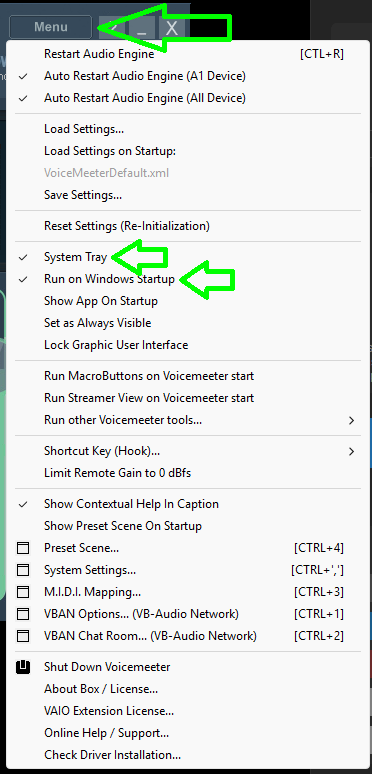
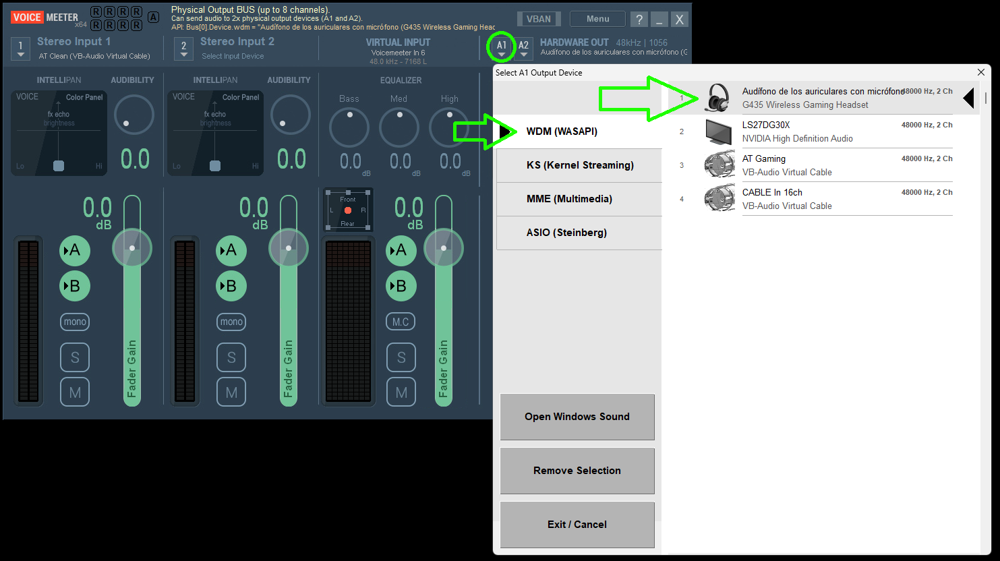
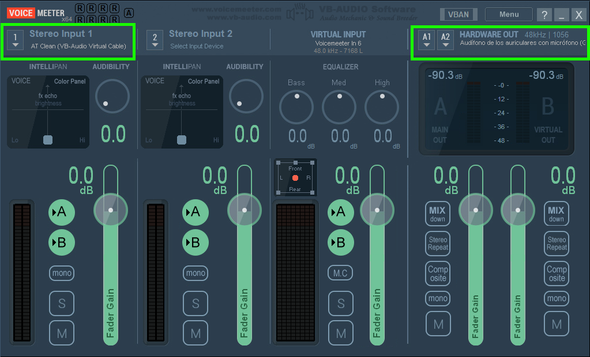

# 🎧 AudioTweaker

Optimizador de audio para gaming en Windows. Aplica curvas de corrección AutoEQ por auricular, supresión de disparos con compresión VST y boost de pasos — todo con un solo click. Permite escuchar el juego con EQ y Discord limpio al mismo tiempo.

> Desarrollado por **Jeison Ramirez**
> · TikTok [@piranha_gg](https://tiktok.com/@piranha_gg)
> ☕ [Apoyar con donación](https://paypal.me/Piranha97)

---

## ¿Qué hace?

- **AutoEQ integrado** — curvas de corrección medidas para tu auricular. Si no está en la lista, búscalo entre miles de modelos directamente desde la app.
- **Supresión de disparos** — compresión broadband (ReaComp) y multiband (ReaXcomp) para bajar el volumen de disparos sin perder los pasos del enemigo.
- **3 perfiles de combate:**
  - 🔇 **Agresivo** — disparos casi silenciados, pasos al máximo
  - 🔉 **Moderado** — balance entre sonido natural y ventaja táctica
  - 🔊 **Sin supresión** — EQ solamente, sonido más natural
- **Juego con EQ + Discord limpio** — el juego pasa por el procesador de audio (AT Gaming) y Discord llega directo a los audífonos sin modificar.
- **Configuración automática** — detecta tu dispositivo y lo registra sin tocar nada a mano.

---

## Instalación completa (paso a paso)

### Paso 1 — Descarga e instala AudioTweaker

1. Descarga `AudioTweaker-Setup.exe` de [Releases](../../releases)
2. Ejecuta el instalador **como Administrador**
3. Al abrir la app aparece el asistente de configuración — sigue los pasos en orden

---

### Paso 2 — Motor de audio (automático)

La app instala esto sola:

| Dependencia | Para qué sirve |
|---|---|
| **Equalizer APO** | Motor que procesa el audio en tiempo real |
| **ReaPlugs VST** | Compresor de disparos (ReaComp + ReaXcomp) |

Haz click en los botones de instalación dentro de la app. Acepta el UAC cuando aparezca.

---

### Paso 3 — Enrutamiento de audio (manual, gratis)

Estas dos apps crean el canal virtual que separa el juego de Discord:

#### 3a. VB-Cable
1. En la app, click **"🌐 Descargar VB-Cable"**
2. Se abre la página oficial de VB-Audio → descarga el ZIP
3. Extrae el ZIP → ejecuta `VBCABLE_Setup_x64.exe` como **Administrador**
4. Instala normalmente

#### 3b. Voicemeeter
1. En la app, click **"🌐 Descargar Voicemeeter"**
2. Se abre la página oficial → descarga **Voicemeeter Standard o Banana**
3. Instala normalmente



---

### Paso 4 — Reiniciar el PC

Después de instalar VB-Cable y Voicemeeter es **obligatorio reiniciar** para que Windows reconozca los dispositivos.

> La app tiene un botón **"🔄 Reiniciar PC ahora"** que lo hace automáticamente.

---

### Paso 5 — Configurar dispositivos (automático)

Después del reinicio, abre AudioTweaker de nuevo:

1. Click **"🏷️ Renombrar AT Gaming / AT Clean"** — renombra VB-Cable para que sea reconocido por la app
2. Click **"⚙️ Configurar Voicemeeter"** — configura automáticamente el mezclador de audio

---

### Paso 5b — Configuración de Voicemeeter

**A1 = tus audífonos físicos:**



**Vista general configurada:**



- **Strip 1** → AT Clean (VB-Audio Virtual Cable), botón **A** verde
- **Virtual Input** → botón **A** verde (Discord llega aquí)
- **A1** → tus audífonos físicos (G435 o el que tengas)

---

### Paso 6 — Configurar Discord y el juego

**En Discord:** (si lo usas)
- Ajustes → Voz y video → Dispositivo de salida → **Tus Audifonos**

**En el juego (Warzone, etc.):**
- Ajustes de audio → Dispositivo de salida → **AT Gaming**
- Chat De Voz → Dispositivo de salida → **TUS AUDIFONOS** para que salga la voz limpia
- Microfono → **Tu Microfono**

---

### Paso 7 — Usar AudioTweaker

1. Selecciona tu **auricular** en el dropdown
   - Si no aparece, click en *"🔍 Buscar otro auricular en AutoEQ"*
2. Selecciona el **juego**
3. Selecciona el **perfil de combate**
4. Click **⚡ Aplicar Perfil**

---

## Cómo funciona el audio

```
Juego  ──→ AT Gaming ──APO+EQ──→ AT Clean ──→ Voicemeeter ──→ Audífonos ✅
Discord ──→ Voicemeeter Input ──────────────→ Voicemeeter ──→ Audífonos ✅ (limpio)
```

- **AT Gaming** — canal virtual donde el juego manda su audio. APO aplica EQ + compresión aquí.
- **AT Clean** — salida del cable virtual. El audio ya procesado entra a Voicemeeter.
- **Voicemeeter** — mezclador que une el juego (con EQ) y Discord (limpio) y los manda a los audífonos.

---

## Tweaks adicionales (ventana principal)

| Botón | Función |
|---|---|
| 🔧 Configurar APO para auricular | Registra APO en el dispositivo seleccionado |
| 🗑️ Quitar APO del auricular | Desregistra APO (útil para audífonos físicos) |
| Deshabilitar Audio Enhancements | Desactiva mejoras de Windows que distorsionan el audio |
| Restaurar Defaults | Vuelve el audio a cero (elimina todos los filtros) |

---

## Empaquetar desde código fuente

```bash
pip install customtkinter sounddevice pyinstaller
pyinstaller --onefile --windowed --icon=icon.ico --add-data "icon.ico;." --name AudioTweaker app.py
```

---

## Créditos

- [AutoEQ](https://github.com/jaakkopasanen/AutoEq) — base de datos de curvas de corrección
- [ReaPlugs](https://www.reaper.fm/reaplugs/) — VST de compresión (Cockos)
- [Equalizer APO](https://sourceforge.net/projects/equalizerapo/) — motor de procesamiento de audio
- [VB-Cable](https://vb-audio.com/Cable/) — cable de audio virtual
- [Voicemeeter](https://vb-audio.com/Voicemeeter/) — mezclador de audio virtual
